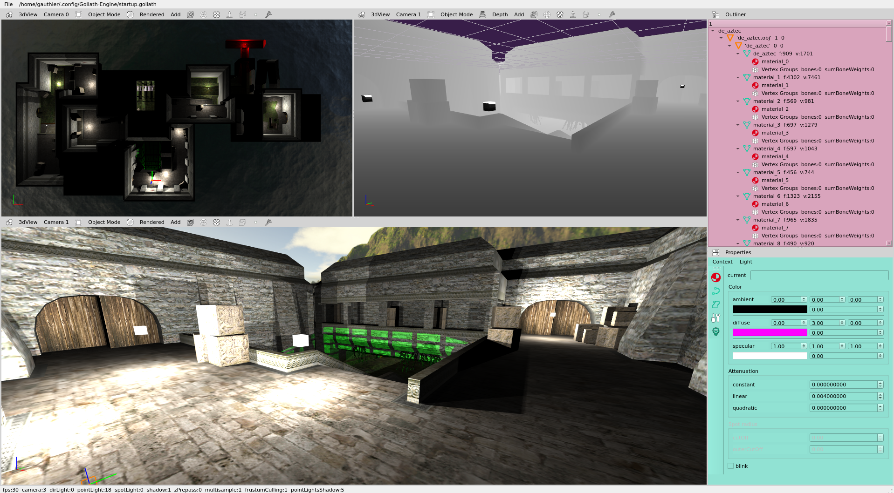
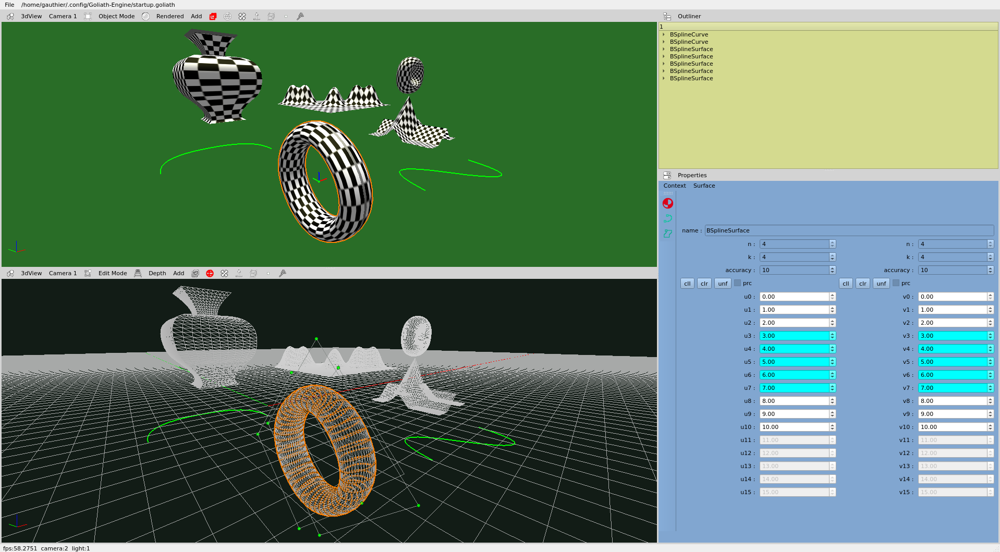
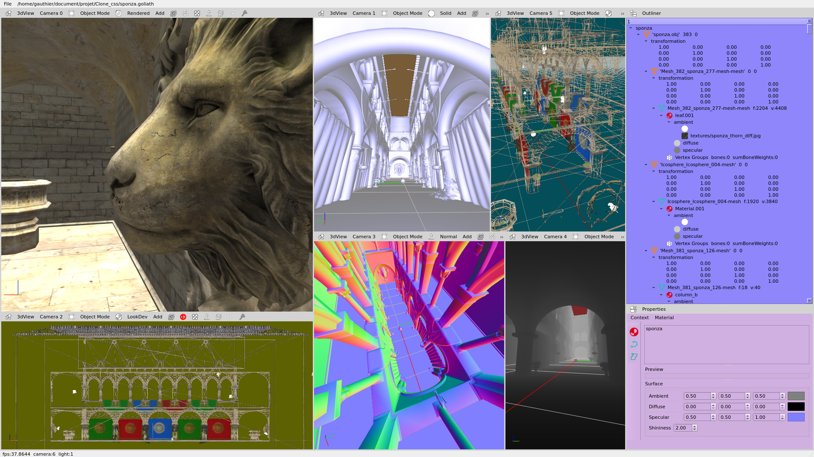

# Goliath-Engine_standalone
My first experimental engine (C++, OpenGL, Qt) for rendering, modelisation and animation

Gui (clone Blender)


Release date :  February 2020

Code is in a private repo (Precompiled library)

Source is coming soon


## Dependencies
* Assimp (no submodule, system library, compiled with latest version on Arch Linux)
* glm (no submodule, system library, compiled with latest version on Arch Linux)


###  Building on Linux (command line instruction)
```bash
$ mkdir build
$ cd build
$ cmake ..
$ make
```

## Shadow and light
<!-- [](https://youtu.be/gDdghUDYpok "view on youtube") -->
[](https://youtu.be/gDdghUDYpok "view on youtube")
<!-- https://youtu.be/gDdghUDYpok -->

## Frustum culling
[](https://youtu.be/xsooSpulDy8 "view on youtube")
<!-- https://youtu.be/xsooSpulDy8 -->

## Modelisation : BSpline
<!-- [](https://youtu.be/0qHZ_LvAo_0 "wiew on youtube") -->
[](https://youtu.be/Ms513wlBTy4 "wiew on youtube")

### Additional video
https://youtu.be/0qHZ_LvAo_0

## Multiple view camera (Sponza)

